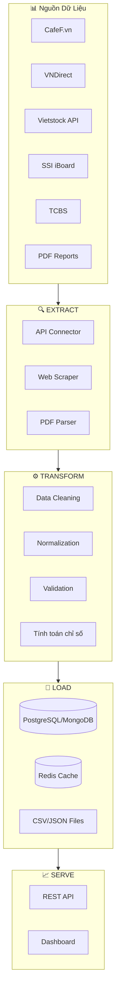
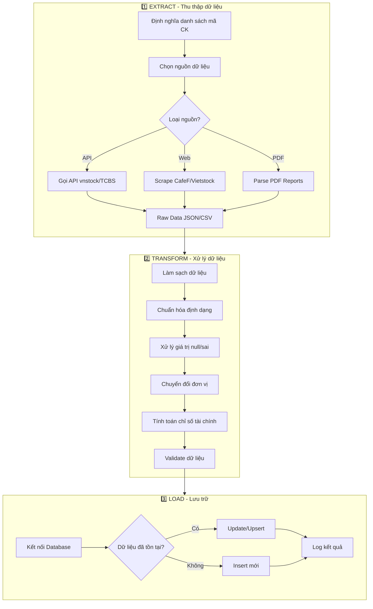

# Quy Trình Cào Dữ Liệu Báo Cáo Tài Chính

> **Đồ án tốt nghiệp**: Hỗ trợ đầu tư cho người phân tích cơ bản
> **Mục tiêu**: Thu thập và xử lý dữ liệu báo cáo tài chính từ các nguồn chính thống Việt Nam

---

## 1. Tổng Quan Kiến Trúc ETL



---

## 2. Nguồn Dữ Liệu Chính Thống

### 2.1. Nguồn Có API/Dễ Cào

| Nguồn | Loại Dữ Liệu | Phương Thức | Độ Khó | Ghi Chú |
|-------|--------------|-------------|--------|---------|
| **vnstock (Python)** | BCTC, giá, tin tức | Python Library | ⭐ Dễ | **Khuyến nghị dùng** |
| **CafeF.vn** | BCTC đầy đủ | Web Scraping | ⭐⭐ Trung bình | Dữ liệu phong phú |
| **VNDirect** | BCTC, chỉ số | API + Scraping | ⭐⭐ Trung bình | API không chính thức |
| **Vietstock.vn** | BCTC chi tiết | Scraping | ⭐⭐⭐ Khó | Cần đăng nhập |
| **SSI iBoard** | Realtime + BCTC | API | ⭐⭐ Trung bình | API có rate limit |
| **TCBS** | BCTC, phân tích | API | ⭐⭐ Trung bình | Dữ liệu tốt |
| **FiinTrade** | BCTC chuyên sâu | API (có phí) | ⭐ Dễ | Chất lượng cao, có phí |

### 2.2. Nguồn PDF Báo Cáo

| Nguồn | Mô Tả |
|-------|-------|
| **HOSE/HNX** | Báo cáo từ sàn chứng khoán |
| **Website công ty** | Báo cáo thường niên, BCTC quý |
| **CafeF/Vietstock** | PDF BCTC đã công bố |

---

## 3. Chi Tiết Phương Pháp Thu Thập

### 3.1. Sử dụng thư viện vnstock (⭐ KHUYẾN NGHỊ)

> [!TIP]
> **vnstock** là thư viện Python miễn phí, cung cấp dữ liệu tài chính Việt Nam chuẩn hóa sẵn.

```python
# Cài đặt
# pip install vnstock

from vnstock import Vnstock

# Khởi tạo
stock = Vnstock()

# ===== LẤY DANH SÁCH MÃ CỔ PHIẾU =====
listing = stock.stock(symbol='VNM', source='VCI')
all_symbols = listing.listing.all_symbols()
print(all_symbols.head())

# ===== LẤY BÁO CÁO TÀI CHÍNH =====
# Bảng cân đối kế toán
balance_sheet = listing.finance.balance_sheet(period='quarter', lang='vi')

# Báo cáo kết quả kinh doanh  
income_statement = listing.finance.income_statement(period='quarter', lang='vi')

# Báo cáo lưu chuyển tiền tệ
cash_flow = listing.finance.cash_flow(period='quarter', lang='vi')

# ===== LẤY CHỈ SỐ TÀI CHÍNH =====
# Chỉ số định giá: P/E, P/B, EV/EBITDA...
ratios = listing.finance.ratio(period='quarter', lang='vi')

# ===== LẤY GIÁ LỊCH SỬ =====
historical_price = listing.quote.history(start='2020-01-01', end='2024-12-31')
```

**Dữ liệu có sẵn từ vnstock:**
- ✅ Bảng cân đối kế toán (Balance Sheet)
- ✅ Báo cáo KQKD (Income Statement)
- ✅ Lưu chuyển tiền tệ (Cash Flow)
- ✅ Các chỉ số tài chính (ROE, ROA, P/E, P/B, EPS...)
- ✅ Giá lịch sử, khối lượng giao dịch
- ✅ Thông tin doanh nghiệp

---

### 3.2. Web Scraping từ CafeF

```python
import requests
from bs4 import BeautifulSoup
import pandas as pd
import time

class CafeFScraper:
    """
    Scraper cho CafeF.vn - thu thập báo cáo tài chính
    """
    
    BASE_URL = "https://s.cafef.vn"
    
    # Endpoints cho báo cáo tài chính
    ENDPOINTS = {
        'balance_sheet': '/bao-cao-tai-chinh/{symbol}/can-doi-ke-toan/0/0/0/0/0.chn',
        'income_statement': '/bao-cao-tai-chinh/{symbol}/ket-qua-kinh-doanh/0/0/0/0/0.chn',
        'cash_flow': '/bao-cao-tai-chinh/{symbol}/luu-chuyen-tien-te/0/0/0/0/0.chn',
    }
    
    HEADERS = {
        'User-Agent': 'Mozilla/5.0 (Windows NT 10.0; Win64; x64) AppleWebKit/537.36',
        'Accept': 'text/html,application/xhtml+xml',
        'Accept-Language': 'vi-VN,vi;q=0.9,en;q=0.8',
    }
    
    def __init__(self, delay=2):
        """
        Args:
            delay: Thời gian chờ giữa các request (giây) để tránh bị block
        """
        self.session = requests.Session()
        self.session.headers.update(self.HEADERS)
        self.delay = delay
    
    def get_balance_sheet(self, symbol: str) -> pd.DataFrame:
        """
        Lấy bảng cân đối kế toán
        
        Args:
            symbol: Mã cổ phiếu (VD: VNM, FPT, VIC)
        
        Returns:
            DataFrame chứa dữ liệu bảng cân đối kế toán
        """
        url = self.BASE_URL + self.ENDPOINTS['balance_sheet'].format(symbol=symbol)
        return self._scrape_financial_table(url)
    
    def get_income_statement(self, symbol: str) -> pd.DataFrame:
        """Lấy báo cáo kết quả kinh doanh"""
        url = self.BASE_URL + self.ENDPOINTS['income_statement'].format(symbol=symbol)
        return self._scrape_financial_table(url)
    
    def get_cash_flow(self, symbol: str) -> pd.DataFrame:
        """Lấy báo cáo lưu chuyển tiền tệ"""
        url = self.BASE_URL + self.ENDPOINTS['cash_flow'].format(symbol=symbol)
        return self._scrape_financial_table(url)
    
    def _scrape_financial_table(self, url: str) -> pd.DataFrame:
        """
        Scrape bảng dữ liệu tài chính từ URL
        """
        time.sleep(self.delay)  # Rate limiting
        
        try:
            response = self.session.get(url, timeout=30)
            response.raise_for_status()
            
            soup = BeautifulSoup(response.content, 'html.parser')
            
            # Tìm bảng dữ liệu chính
            table = soup.find('table', {'id': 'tableContent'})
            if not table:
                table = soup.find('table', class_='table-data')
            
            if table:
                df = pd.read_html(str(table))[0]
                return self._clean_dataframe(df)
            
            return pd.DataFrame()
            
        except Exception as e:
            print(f"Lỗi khi scrape {url}: {e}")
            return pd.DataFrame()
    
    def _clean_dataframe(self, df: pd.DataFrame) -> pd.DataFrame:
        """Làm sạch DataFrame"""
        # Loại bỏ cột/hàng trống
        df = df.dropna(how='all', axis=0)
        df = df.dropna(how='all', axis=1)
        
        # Chuyển đổi số
        for col in df.columns[1:]:
            df[col] = pd.to_numeric(
                df[col].astype(str).str.replace(',', '').str.replace(' ', ''),
                errors='coerce'
            )
        
        return df


# ===== SỬ DỤNG =====
if __name__ == "__main__":
    scraper = CafeFScraper(delay=2)
    
    # Lấy BCTC của Vinamilk
    balance_sheet = scraper.get_balance_sheet('VNM')
    income_stmt = scraper.get_income_statement('VNM')
    cash_flow = scraper.get_cash_flow('VNM')
    
    print("=== BẢNG CÂN ĐỐI KẾ TOÁN ===")
    print(balance_sheet.head(10))
```

---

### 3.3. Trích xuất dữ liệu từ PDF

```python
import pdfplumber
import camelot
import tabula
import pandas as pd
from pathlib import Path

class PDFFinancialExtractor:
    """
    Trích xuất bảng số liệu từ PDF báo cáo tài chính
    
    Sử dụng nhiều thư viện để tăng độ chính xác:
    - pdfplumber: Tốt cho text và bảng đơn giản
    - camelot: Tốt cho bảng phức tạp
    - tabula: Backup option
    """
    
    def __init__(self, pdf_path: str):
        self.pdf_path = Path(pdf_path)
        
    def extract_with_pdfplumber(self) -> list[pd.DataFrame]:
        """
        Trích xuất bảng bằng pdfplumber
        Ưu điểm: Nhẹ, chính xác với PDF đơn giản
        """
        tables = []
        
        with pdfplumber.open(self.pdf_path) as pdf:
            for page_num, page in enumerate(pdf.pages):
                # Trích xuất tất cả bảng trong trang
                page_tables = page.extract_tables()
                
                for table in page_tables:
                    if table and len(table) > 1:
                        df = pd.DataFrame(table[1:], columns=table[0])
                        df['_page'] = page_num + 1
                        tables.append(df)
        
        return tables
    
    def extract_with_camelot(self, pages='all') -> list[pd.DataFrame]:
        """
        Trích xuất bảng bằng Camelot
        Ưu điểm: Tốt cho bảng phức tạp, có đường kẻ
        
        Yêu cầu: pip install camelot-py[cv] ghostscript
        """
        tables = []
        
        try:
            # Thử với flavor='lattice' (cho bảng có đường kẻ)
            extracted = camelot.read_pdf(
                str(self.pdf_path),
                pages=pages,
                flavor='lattice'
            )
            
            for table in extracted:
                if table.df.shape[0] > 1:
                    tables.append(table.df)
                    
        except Exception:
            # Fallback sang 'stream' flavor
            extracted = camelot.read_pdf(
                str(self.pdf_path),
                pages=pages,
                flavor='stream'
            )
            
            for table in extracted:
                if table.df.shape[0] > 1:
                    tables.append(table.df)
        
        return tables
    
    def extract_with_tabula(self, pages='all') -> list[pd.DataFrame]:
        """
        Trích xuất bảng bằng Tabula
        Yêu cầu: pip install tabula-py, Java Runtime
        """
        try:
            tables = tabula.read_pdf(
                str(self.pdf_path),
                pages=pages,
                multiple_tables=True
            )
            return [df for df in tables if df.shape[0] > 1]
        except Exception as e:
            print(f"Lỗi Tabula: {e}")
            return []
    
    def extract_all(self) -> dict:
        """
        Trích xuất bằng tất cả các phương pháp và trả về kết quả
        """
        return {
            'pdfplumber': self.extract_with_pdfplumber(),
            'camelot': self.extract_with_camelot(),
            'tabula': self.extract_with_tabula(),
        }


# ===== SỬ DỤNG =====
if __name__ == "__main__":
    extractor = PDFFinancialExtractor("path/to/bao-cao-tai-chinh.pdf")
    
    # Trích xuất bằng pdfplumber (đơn giản nhất)
    tables = extractor.extract_with_pdfplumber()
    
    for i, df in enumerate(tables):
        print(f"\n=== BẢNG {i+1} ===")
        print(df.head())
```

---

## 4. Quy Trình ETL Chi Tiết

### 4.1. Process Flow Diagram



### 4.2. Data Schema Đề Xuất

```sql
-- ===== COMPANIES - Thông tin doanh nghiệp =====
CREATE TABLE companies (
    id SERIAL PRIMARY KEY,
    symbol VARCHAR(10) UNIQUE NOT NULL,      -- VNM, FPT, VIC
    name VARCHAR(255) NOT NULL,              -- Tên công ty
    exchange VARCHAR(10),                     -- HOSE, HNX, UPCOM
    industry VARCHAR(100),                    -- Ngành nghề
    sector VARCHAR(100),                      -- Lĩnh vực
    created_at TIMESTAMP DEFAULT NOW(),
    updated_at TIMESTAMP DEFAULT NOW()
);

-- ===== BALANCE_SHEET - Bảng cân đối kế toán =====
CREATE TABLE balance_sheets (
    id SERIAL PRIMARY KEY,
    symbol VARCHAR(10) REFERENCES companies(symbol),
    report_date DATE NOT NULL,               -- Ngày báo cáo
    period_type VARCHAR(10),                 -- 'quarter' hoặc 'year'
    fiscal_year INT,
    fiscal_quarter INT,
    
    -- TÀI SẢN
    total_assets DECIMAL(20,2),              -- Tổng tài sản
    current_assets DECIMAL(20,2),            -- Tài sản ngắn hạn
    cash DECIMAL(20,2),                      -- Tiền và tương đương tiền
    short_term_investments DECIMAL(20,2),    -- Đầu tư ngắn hạn
    receivables DECIMAL(20,2),               -- Phải thu
    inventory DECIMAL(20,2),                 -- Hàng tồn kho
    non_current_assets DECIMAL(20,2),        -- Tài sản dài hạn
    fixed_assets DECIMAL(20,2),              -- Tài sản cố định
    
    -- NỢ PHẢI TRẢ
    total_liabilities DECIMAL(20,2),         -- Tổng nợ phải trả
    current_liabilities DECIMAL(20,2),       -- Nợ ngắn hạn
    long_term_debt DECIMAL(20,2),            -- Nợ dài hạn
    
    -- VỐN CHỦ SỞ HỮU
    total_equity DECIMAL(20,2),              -- Vốn chủ sở hữu
    share_capital DECIMAL(20,2),             -- Vốn góp
    retained_earnings DECIMAL(20,2),         -- Lợi nhuận giữ lại
    
    created_at TIMESTAMP DEFAULT NOW(),
    UNIQUE(symbol, report_date, period_type)
);

-- ===== INCOME_STATEMENTS - Báo cáo KQKD =====
CREATE TABLE income_statements (
    id SERIAL PRIMARY KEY,
    symbol VARCHAR(10) REFERENCES companies(symbol),
    report_date DATE NOT NULL,
    period_type VARCHAR(10),
    fiscal_year INT,
    fiscal_quarter INT,
    
    revenue DECIMAL(20,2),                   -- Doanh thu
    cost_of_goods_sold DECIMAL(20,2),        -- Giá vốn hàng bán
    gross_profit DECIMAL(20,2),              -- Lợi nhuận gộp
    operating_expenses DECIMAL(20,2),        -- Chi phí hoạt động
    operating_income DECIMAL(20,2),          -- Lợi nhuận từ HĐKD
    interest_expense DECIMAL(20,2),          -- Chi phí lãi vay
    profit_before_tax DECIMAL(20,2),         -- Lợi nhuận trước thuế
    income_tax DECIMAL(20,2),                -- Thuế TNDN
    net_income DECIMAL(20,2),                -- Lợi nhuận sau thuế
    eps DECIMAL(10,2),                       -- EPS
    
    created_at TIMESTAMP DEFAULT NOW(),
    UNIQUE(symbol, report_date, period_type)
);

-- ===== CASH_FLOWS - Báo cáo lưu chuyển tiền tệ =====
CREATE TABLE cash_flows (
    id SERIAL PRIMARY KEY,
    symbol VARCHAR(10) REFERENCES companies(symbol),
    report_date DATE NOT NULL,
    period_type VARCHAR(10),
    fiscal_year INT,
    fiscal_quarter INT,
    
    operating_cash_flow DECIMAL(20,2),       -- Dòng tiền từ HĐKD
    investing_cash_flow DECIMAL(20,2),       -- Dòng tiền từ HĐĐT
    financing_cash_flow DECIMAL(20,2),       -- Dòng tiền từ HĐTC
    net_cash_flow DECIMAL(20,2),             -- Dòng tiền thuần
    
    created_at TIMESTAMP DEFAULT NOW(),
    UNIQUE(symbol, report_date, period_type)
);

-- ===== FINANCIAL_RATIOS - Chỉ số tài chính =====
CREATE TABLE financial_ratios (
    id SERIAL PRIMARY KEY,
    symbol VARCHAR(10) REFERENCES companies(symbol),
    report_date DATE NOT NULL,
    
    -- Chỉ số định giá
    pe_ratio DECIMAL(10,2),                  -- P/E
    pb_ratio DECIMAL(10,2),                  -- P/B
    ps_ratio DECIMAL(10,2),                  -- P/S
    
    -- Chỉ số sinh lời
    roe DECIMAL(10,4),                       -- Return on Equity
    roa DECIMAL(10,4),                       -- Return on Assets
    ros DECIMAL(10,4),                       -- Return on Sales
    gross_margin DECIMAL(10,4),              -- Biên lợi nhuận gộp
    net_margin DECIMAL(10,4),                -- Biên lợi nhuận ròng
    
    -- Chỉ số thanh khoản
    current_ratio DECIMAL(10,2),             -- Hệ số thanh toán hiện hành
    quick_ratio DECIMAL(10,2),               -- Hệ số thanh toán nhanh
    
    -- Chỉ số đòn bẩy
    debt_to_equity DECIMAL(10,2),            -- Nợ/Vốn CSH
    debt_to_assets DECIMAL(10,4),            -- Nợ/Tổng tài sản
    
    created_at TIMESTAMP DEFAULT NOW(),
    UNIQUE(symbol, report_date)
);

-- Index để tăng tốc query
CREATE INDEX idx_balance_symbol ON balance_sheets(symbol);
CREATE INDEX idx_income_symbol ON income_statements(symbol);
CREATE INDEX idx_ratios_symbol ON financial_ratios(symbol);
```

---

## 5. Pipeline ETL Hoàn Chỉnh

### 5.1. Cấu Trúc Project

```
financial-data-pipeline/
├── config/
│   ├── __init__.py
│   ├── settings.py          # Cấu hình database, API keys
│   └── symbols.json          # Danh sách mã cổ phiếu cần cào
├── extractors/
│   ├── __init__.py
│   ├── vnstock_extractor.py  # Sử dụng thư viện vnstock
│   ├── cafef_scraper.py      # Scraper cho CafeF
│   ├── vndirect_api.py       # API VNDirect
│   └── pdf_extractor.py      # Trích xuất từ PDF
├── transformers/
│   ├── __init__.py
│   ├── cleaner.py            # Làm sạch dữ liệu
│   ├── normalizer.py         # Chuẩn hóa format
│   └── calculator.py         # Tính chỉ số tài chính
├── loaders/
│   ├── __init__.py
│   ├── postgres_loader.py    # Load vào PostgreSQL
│   └── csv_loader.py         # Xuất ra CSV
├── models/
│   ├── __init__.py
│   └── financial.py          # Data models/schemas
├── utils/
│   ├── __init__.py
│   ├── logger.py             # Logging
│   └── validators.py         # Validation rules
├── pipelines/
│   ├── __init__.py
│   └── full_pipeline.py      # Pipeline chính
├── tests/
├── main.py                   # Entry point
├── requirements.txt
└── README.md
```

### 5.2. Pipeline Code

```python
# pipelines/full_pipeline.py

import logging
from datetime import datetime
from typing import List, Optional
from dataclasses import dataclass
from vnstock import Vnstock
import pandas as pd

from config.settings import DB_CONFIG, SYMBOLS
from transformers.cleaner import DataCleaner
from transformers.calculator import RatioCalculator
from loaders.postgres_loader import PostgresLoader

logger = logging.getLogger(__name__)


@dataclass
class PipelineConfig:
    """Cấu hình cho pipeline"""
    symbols: List[str]               # Danh sách mã cổ phiếu
    start_date: Optional[str] = None # Ngày bắt đầu lấy dữ liệu
    period: str = 'quarter'          # 'quarter' hoặc 'year'
    save_to_db: bool = True
    save_to_csv: bool = True
    csv_output_dir: str = './output'


class FinancialDataPipeline:
    """
    Pipeline ETL hoàn chỉnh cho dữ liệu tài chính
    
    Quy trình:
    1. Extract: Lấy dữ liệu từ vnstock API
    2. Transform: Làm sạch, chuẩn hóa, tính chỉ số
    3. Load: Lưu vào database và/hoặc CSV
    """
    
    def __init__(self, config: PipelineConfig):
        self.config = config
        self.stock = Vnstock()
        self.cleaner = DataCleaner()
        self.calculator = RatioCalculator()
        self.loader = PostgresLoader(DB_CONFIG) if config.save_to_db else None
        
        # Tracking
        self.stats = {
            'total_symbols': len(config.symbols),
            'success': 0,
            'failed': 0,
            'errors': []
        }
    
    def run(self):
        """Chạy pipeline"""
        logger.info(f"🚀 Bắt đầu pipeline cho {len(self.config.symbols)} mã cổ phiếu")
        start_time = datetime.now()
        
        for symbol in self.config.symbols:
            try:
                self._process_symbol(symbol)
                self.stats['success'] += 1
                logger.info(f"✅ {symbol}: Hoàn thành")
                
            except Exception as e:
                self.stats['failed'] += 1
                self.stats['errors'].append({'symbol': symbol, 'error': str(e)})
                logger.error(f"❌ {symbol}: Lỗi - {e}")
        
        elapsed = (datetime.now() - start_time).total_seconds()
        self._log_summary(elapsed)
    
    def _process_symbol(self, symbol: str):
        """Xử lý một mã cổ phiếu"""
        
        # ===== 1. EXTRACT =====
        logger.info(f"📥 [{symbol}] Extracting...")
        stock_data = self.stock.stock(symbol=symbol, source='VCI')
        
        # Lấy các báo cáo
        balance_sheet = stock_data.finance.balance_sheet(
            period=self.config.period, 
            lang='vi'
        )
        income_stmt = stock_data.finance.income_statement(
            period=self.config.period, 
            lang='vi'
        )
        cash_flow = stock_data.finance.cash_flow(
            period=self.config.period, 
            lang='vi'
        )
        ratios = stock_data.finance.ratio(
            period=self.config.period, 
            lang='vi'
        )
        
        # ===== 2. TRANSFORM =====
        logger.info(f"⚙️ [{symbol}] Transforming...")
        
        # Làm sạch dữ liệu
        balance_sheet = self.cleaner.clean(balance_sheet)
        income_stmt = self.cleaner.clean(income_stmt)
        cash_flow = self.cleaner.clean(cash_flow)
        
        # Thêm metadata
        for df in [balance_sheet, income_stmt, cash_flow, ratios]:
            if not df.empty:
                df['symbol'] = symbol
                df['extracted_at'] = datetime.now()
        
        # Tính thêm chỉ số (nếu cần)
        extra_ratios = self.calculator.calculate_all(
            balance_sheet, 
            income_stmt, 
            cash_flow
        )
        
        # ===== 3. LOAD =====
        logger.info(f"💾 [{symbol}] Loading...")
        
        if self.config.save_to_db and self.loader:
            self.loader.upsert_balance_sheet(balance_sheet)
            self.loader.upsert_income_statement(income_stmt)
            self.loader.upsert_cash_flow(cash_flow)
            self.loader.upsert_ratios(ratios)
        
        if self.config.save_to_csv:
            self._save_to_csv(symbol, {
                'balance_sheet': balance_sheet,
                'income_statement': income_stmt,
                'cash_flow': cash_flow,
                'ratios': ratios,
            })
    
    def _save_to_csv(self, symbol: str, data: dict):
        """Lưu dữ liệu ra CSV"""
        import os
        output_dir = os.path.join(self.config.csv_output_dir, symbol)
        os.makedirs(output_dir, exist_ok=True)
        
        for name, df in data.items():
            if not df.empty:
                filepath = os.path.join(output_dir, f'{name}.csv')
                df.to_csv(filepath, index=False, encoding='utf-8-sig')
    
    def _log_summary(self, elapsed: float):
        """Log tổng kết"""
        logger.info("=" * 50)
        logger.info("📊 TỔNG KẾT PIPELINE")
        logger.info(f"   Tổng số mã: {self.stats['total_symbols']}")
        logger.info(f"   Thành công: {self.stats['success']}")
        logger.info(f"   Thất bại: {self.stats['failed']}")
        logger.info(f"   Thời gian: {elapsed:.2f}s")
        logger.info("=" * 50)


# ===== CHẠY PIPELINE =====
if __name__ == "__main__":
    # Cấu hình
    config = PipelineConfig(
        symbols=['VNM', 'FPT', 'VIC', 'VHM', 'HPG', 'MWG', 'TCB', 'VCB'],
        period='quarter',
        save_to_db=False,  # Đặt True nếu có database
        save_to_csv=True,
        csv_output_dir='./financial_data'
    )
    
    # Chạy
    pipeline = FinancialDataPipeline(config)
    pipeline.run()
```

---

## 6. Xử Lý Chỉ Số Tài Chính

### 6.1. Công Thức Tính Chỉ Số

```python
# transformers/calculator.py

import pandas as pd
import numpy as np

class RatioCalculator:
    """
    Tính toán các chỉ số tài chính phục vụ phân tích cơ bản
    """
    
    @staticmethod
    def calculate_profitability(income_df: pd.DataFrame) -> dict:
        """
        Chỉ số sinh lời
        """
        return {
            # Biên lợi nhuận gộp = Lợi nhuận gộp / Doanh thu
            'gross_margin': income_df['gross_profit'] / income_df['revenue'],
            
            # Biên lợi nhuận ròng = Lợi nhuận sau thuế / Doanh thu  
            'net_margin': income_df['net_income'] / income_df['revenue'],
            
            # Biên EBIT = Lợi nhuận từ HĐKD / Doanh thu
            'operating_margin': income_df['operating_income'] / income_df['revenue'],
        }
    
    @staticmethod
    def calculate_return_ratios(
        income_df: pd.DataFrame, 
        balance_df: pd.DataFrame
    ) -> dict:
        """
        Chỉ số hiệu suất sử dụng vốn
        """
        # Vốn chủ sở hữu bình quân
        avg_equity = (balance_df['total_equity'] + balance_df['total_equity'].shift(1)) / 2
        
        # Tổng tài sản bình quân
        avg_assets = (balance_df['total_assets'] + balance_df['total_assets'].shift(1)) / 2
        
        return {
            # ROE = Lợi nhuận sau thuế / Vốn CSH bình quân
            'roe': income_df['net_income'] / avg_equity,
            
            # ROA = Lợi nhuận sau thuế / Tổng tài sản bình quân
            'roa': income_df['net_income'] / avg_assets,
            
            # ROIC = NOPAT / Invested Capital
            # NOPAT = EBIT * (1 - Tax Rate)
        }
    
    @staticmethod
    def calculate_liquidity(balance_df: pd.DataFrame) -> dict:
        """
        Chỉ số thanh khoản
        """
        return {
            # Hệ số thanh toán hiện hành = Tài sản ngắn hạn / Nợ ngắn hạn
            'current_ratio': balance_df['current_assets'] / balance_df['current_liabilities'],
            
            # Hệ số thanh toán nhanh = (TSNH - Hàng tồn kho) / Nợ ngắn hạn
            'quick_ratio': (balance_df['current_assets'] - balance_df['inventory']) / balance_df['current_liabilities'],
            
            # Hệ số thanh toán tiền = Tiền / Nợ ngắn hạn
            'cash_ratio': balance_df['cash'] / balance_df['current_liabilities'],
        }
    
    @staticmethod
    def calculate_leverage(balance_df: pd.DataFrame) -> dict:
        """
        Chỉ số đòn bẩy tài chính
        """
        return {
            # Nợ / Vốn CSH
            'debt_to_equity': balance_df['total_liabilities'] / balance_df['total_equity'],
            
            # Nợ / Tổng tài sản
            'debt_to_assets': balance_df['total_liabilities'] / balance_df['total_assets'],
            
            # Hệ số tự tài trợ = Vốn CSH / Tổng tài sản
            'equity_ratio': balance_df['total_equity'] / balance_df['total_assets'],
        }
    
    @staticmethod
    def calculate_valuation(
        price: float,
        market_cap: float,
        income_df: pd.DataFrame,
        balance_df: pd.DataFrame
    ) -> dict:
        """
        Chỉ số định giá (cần thêm giá thị trường)
        """
        return {
            # P/E = Giá / EPS
            'pe_ratio': price / income_df['eps'],
            
            # P/B = Vốn hóa / Vốn CSH
            'pb_ratio': market_cap / balance_df['total_equity'],
            
            # P/S = Vốn hóa / Doanh thu
            'ps_ratio': market_cap / income_df['revenue'],
        }
    
    def calculate_all(
        self, 
        balance_df: pd.DataFrame,
        income_df: pd.DataFrame,
        cash_flow_df: pd.DataFrame
    ) -> pd.DataFrame:
        """
        Tính tất cả chỉ số và gộp thành DataFrame
        """
        result = pd.DataFrame()
        
        # Tính từng nhóm chỉ số
        result = result.assign(**self.calculate_profitability(income_df))
        result = result.assign(**self.calculate_return_ratios(income_df, balance_df))
        result = result.assign(**self.calculate_liquidity(balance_df))
        result = result.assign(**self.calculate_leverage(balance_df))
        
        return result
```

---

## 7. Lịch Trình Chạy Tự Động

### 7.1. Sử dụng APScheduler

```python
# scheduler.py

from apscheduler.schedulers.blocking import BlockingScheduler
from apscheduler.triggers.cron import CronTrigger
from pipelines.full_pipeline import FinancialDataPipeline, PipelineConfig
import logging

logging.basicConfig(level=logging.INFO)
logger = logging.getLogger(__name__)

# Danh sách các mã cổ phiếu quan tâm
SYMBOLS = ['VNM', 'FPT', 'VIC', 'VHM', 'HPG', 'MWG', 'TCB', 'VCB', 'ACB', 'VPB']


def run_daily_price_update():
    """Cập nhật giá hàng ngày"""
    logger.info("🕐 Bắt đầu cập nhật giá hàng ngày...")
    # Logic cập nhật giá
    pass


def run_quarterly_financial_update():
    """Cập nhật BCTC theo quý (chạy sau mùa báo cáo)"""
    logger.info("📊 Bắt đầu cập nhật BCTC quý...")
    
    config = PipelineConfig(
        symbols=SYMBOLS,
        period='quarter',
        save_to_db=True,
        save_to_csv=True
    )
    
    pipeline = FinancialDataPipeline(config)
    pipeline.run()


if __name__ == "__main__":
    scheduler = BlockingScheduler()
    
    # Cập nhật giá: Thứ 2-6, lúc 17:00 (sau khi sàn đóng cửa)
    scheduler.add_job(
        run_daily_price_update,
        CronTrigger(day_of_week='mon-fri', hour=17, minute=0),
        id='daily_price_update'
    )
    
    # Cập nhật BCTC: Ngày 1 và 15 hàng tháng (bắt các đợt công bố)
    scheduler.add_job(
        run_quarterly_financial_update,
        CronTrigger(day='1,15', hour=20, minute=0),
        id='quarterly_financial_update'
    )
    
    logger.info("⏰ Scheduler đã khởi động")
    scheduler.start()
```

---

## 8. Dependencies

```txt
# requirements.txt

# Core
vnstock>=3.0.0          # Thư viện dữ liệu chứng khoán VN
pandas>=2.0.0
numpy>=1.24.0

# Web Scraping
requests>=2.31.0
beautifulsoup4>=4.12.0
lxml>=4.9.0

# PDF Extraction
pdfplumber>=0.10.0
camelot-py[cv]>=0.11.0  # Yêu cầu Ghostscript
tabula-py>=2.8.0        # Yêu cầu Java

# Database
sqlalchemy>=2.0.0
psycopg2-binary>=2.9.0  # PostgreSQL adapter
# pymongo>=4.5.0        # Nếu dùng MongoDB

# Scheduling
apscheduler>=3.10.0

# Logging & Utils
python-dotenv>=1.0.0
tqdm>=4.66.0

# Testing
pytest>=7.4.0
```

---

## 9. Best Practices & Lưu Ý

> [!WARNING]
> **Rate Limiting**: Luôn thêm delay giữa các request để tránh bị block IP.

> [!IMPORTANT]
> **Data Validation**: Kiểm tra kỹ dữ liệu sau khi extract, đặc biệt với PDF.

### 9.1. Checklist Triển Khai

- [ ] Chọn nguồn dữ liệu phù hợp (vnstock là ưu tiên số 1)
- [ ] Thiết kế database schema
- [ ] Implement extractors cho từng nguồn
- [ ] Xây dựng data cleaning pipeline
- [ ] Thêm validation rules
- [ ] Setup logging và error handling
- [ ] Cấu hình scheduler tự động
- [ ] Viết unit tests
- [ ] Document API/Schema

### 9.2. Xử Lý Lỗi Thường Gặp

| Lỗi | Nguyên Nhân | Giải Pháp |
|-----|-------------|-----------|
| Connection timeout | Website chậm/block | Thêm retry logic, tăng timeout |
| Missing data | BCTC chưa công bố | Check ngày công bố, log và skip |
| Wrong format | Source thay đổi HTML | Update selector, thêm fallback |
| Duplicate data | Upsert không đúng | Check unique constraint |

---

## 10. Tổng Kết

### Quy trình đề xuất cho đồ án:

1. **Bắt đầu với vnstock** - Thư viện Python sẵn có, dễ sử dụng nhất
2. **Bổ sung CafeF scraper** - Lấy thêm dữ liệu chi tiết nếu cần
3. **PDF extraction** - Chỉ dùng khi cần báo cáo gốc từ công ty
4. **Lưu trữ PostgreSQL** - Database quan hệ phù hợp cho dữ liệu tài chính
5. **Scheduler cập nhật** - Tự động hóa việc thu thập định kỳ

### Tài liệu tham khảo:

- [vnstock Documentation](https://docs.vnstock.site/)
- [CafeF](https://cafef.vn)
- [Vietstock](https://vietstock.vn)
